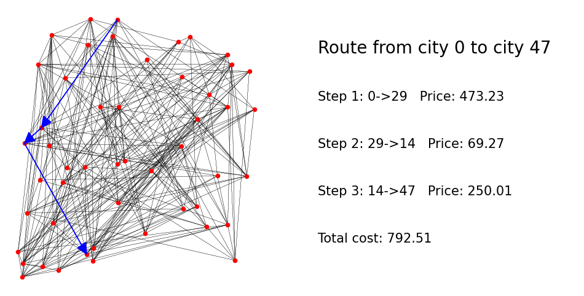

# Incremental Shortest Path (Stevens CPE 593 project)

## Introduction

This project targets the problem of finding the route with cheapest overall flight price from every city to all other cities in a map (An example is shown in the following figure), with specific focus on the effect of appearance of new airlines on the solution. The problem could be formulated as an All-pair shortest path (APSP) problem, where the graph is consists of a set of vertices representing all cities in the map, and a set of edges representing all available airlines. The Flyod Warshall algorithm [1] and the incremental algorithm from [2] are implemented, and their performances are tested on maps of different sizes.



## Project Structure (Only include code files)
    .
    ├── include
    |   ├── map_generator.hpp   # Declaration of the class that handles map generation process
    |   ├── map.hpp             # Declaration of the class that manages map data
    |   ├── solver.hpp          # Declaration of the solver classes 
    ├── scripts
    |   ├── plot_data.py        # Visualization of all experimental data
    |   ├── plot_map.py         # Visualization of query routes 
    ├── thirdparty              # Third party library (only nanoflann)
    ├── main.cpp                # Definition of the main function that runs all experiments
    ├── map_generator.cpp       # Definition of methods of the class Map_generator
    ├── map.cpp                 # Definition of methods of the class Map
    ├── solver.cpp              # Definition of methods of the class Solver 
    ├── CMakeLists.txt          

## Requirements
- Tested on Ubuntu 20.04
- Python 3.8 (for data visualization)

## Result reproduction 

1. Compilation (Navigate to the root directory)
```
mkdir build
cd build
cmake ..
make
```

2. Run experiments
```
./run_main
```

3. Plot experiment and route query results
```
cd ../scripts
python plot_data.py
python plot_map.py
```

## References
[1] Thomas H Cormen, Charles E Leiserson, Ronald L Rivest, and Clifford Stein. Introduction to algorithms. MIT press, 2022. \
[2] Arie Slobbe, Elisabetta Bergamini, and Henning Meyerhenke. Faster incremental all-pairs shortest paths. KIT, 2016.
